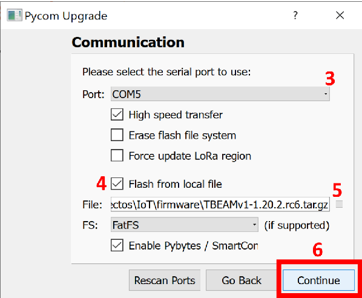

# The TTGO T-Beam
The device that will be used to test our comunications is the LILYGO® TTGO T-Beam v1.0 (868 MHz). It's configured using MicroPython.
- [Images and documentation of the device](http://www.lilygo.cn/claprod_view.aspx?TypeId=62&Id=1281&FId=t28:62:28)

.jpg)

## Guide to setup the device properly to make it work with MicroPython
### Part 1
- Download the driver for the comunication between the TTGO T-Beam and the computer [silicon labs](https://www.silabs.com/developers/usb-to-uart-bridge-vcp-drivers?tab=downloads). Select CP210x Universal Windows Driver, v11.2.0, 10/21/2022 and extract the .zip to a permanent folder. This is required to properly install the Pycom firmware updater.
- Connect the device to your computer, go to "Device Manager".
    - Tipo de dispositivo: Portas (COM e LPT)
    - Silicon Labs CP210x USB to UART Bridge (COM4)
    - Fabricante: Silicon Labs
- Right click the device and go to "properties".
- Go to tab "Driver". Update driver. Browse in your computer for drivers. Then select the folder with the content extracted previously.
### Part 2
- Download and run the [Pycom firmware updater](https://docs.pycom.io/updatefirmware/device/).
- Given Part 1, the USB Port where your device is connected should appear

- In Pycom Upgrade Communication Flash from local file and select [TBEAMv1-1.20.2.r4.tar.gz](https://github.com/nunomcruz/pycom-micropython-sigfox/releases/tag/v1.20.2.r4-tbeamv1) by teacher Nuno Cruz
- In Visual Studio Code install [PyMakr extension](https://marketplace.visualstudio.com/items?itemName=pycom.Pymakr)
- To start setting up your project, see this video -> [MicroPython using VSCode PyMakr on ESP32/ESP8266](https://www.youtube.com/watch?v=YOeV14SESls)

## Resources
- [Connecting the T-Beam to TTN (official)](https://www.thethingsnetwork.org/forum/t/ttgo-t-beam-howto-connect/36757/5)
- [Connecting the T-Beam to TTN (article)](https://www.css-techhelp.com/post/lorawan-connecting-your-device-to-the-things-network)
- [Medium Article - How I sent my first LoRaWAN message to The Things Network using a TTGO ESP32 & Micropython](https://medium.com/@JoooostB/how-i-send-my-first-lorawan-message-to-the-things-network-using-a-ttgo-esp32-micropython-a3fe447fff82)
