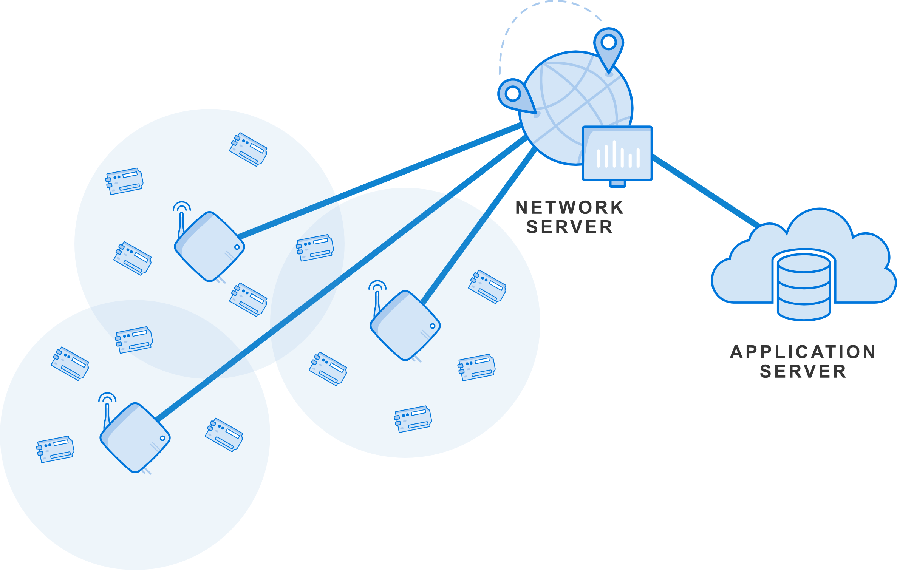
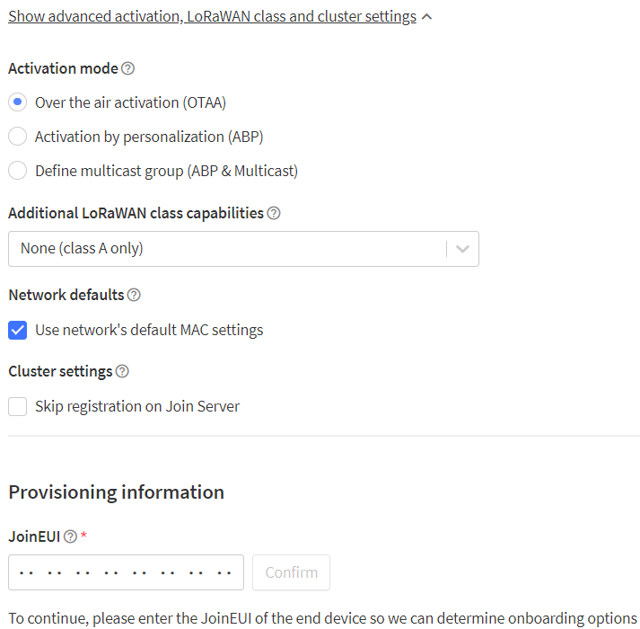
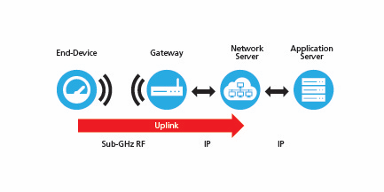
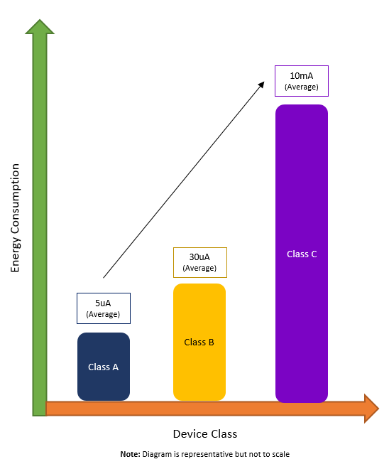
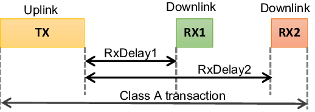
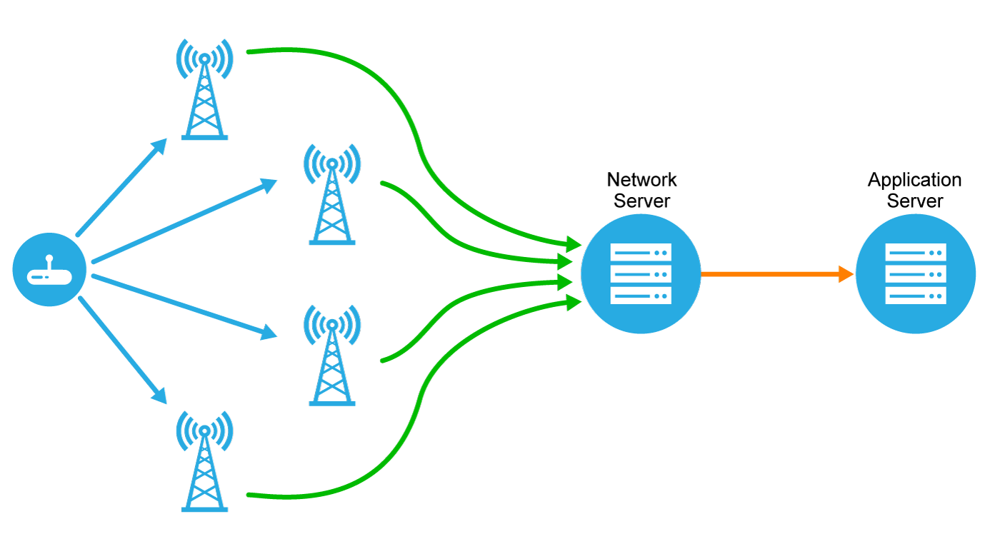
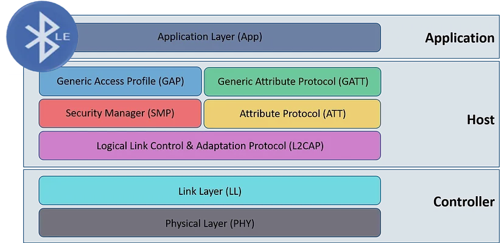
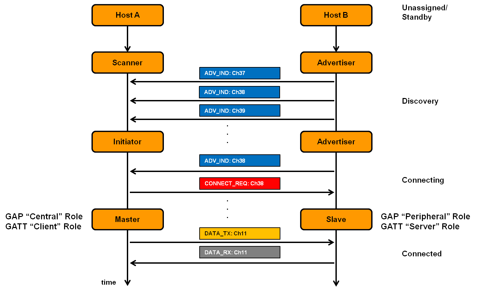
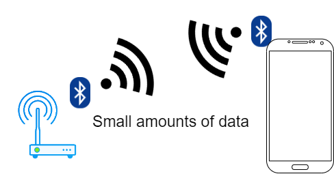

# 4.1 The Things Network (TTN)
## 4.1.1 Descrição e importância da TTN
A The Things Network (TTN) é uma plataforma de rede global, aberta e gratuita projetada para suportar a comunicação de dispositivos IoT por meio do protocolo de rede LoRaWAN. 

A TTN baseia-se em servidores cloud que conecta dispositivos e gateways LoRaWAN no mundo todo. A missão da TTN é construir uma rede de IoT, onde os utilizadores podem construir, manter e gerir a plataforma. A ideia é que qualquer pessoa possa instalar um gateway e contribuir para a expansão da cobertura da rede. Ao conectar dispositivos à TTN, os utilizadores tem acesso a uma rede de comunicação segura, escalável e de baixo custo. A TTN oferece recursos como autenticação de dispositivos, gestão de dados e integração com aplicativos e serviços externos.


A utilização da TTN é especialmente relevante para projetos de IoT que exigem uma cobertura ampla e de alcance global. Com a TTN, os programadores podem aproveitar uma rede estabelecida e colaborativa, evitando a necessidade de construir e manter sua própria plataforma. Além disso, a TTN oferece suporte a diversas aplicações e casos de uso, desde gestão ambiental, agricultura inteligente e até cidades inteligentes.

## 4.1.3 Arquitetura da TTN

A arquitetura da TTN oferece uma plataforma escalável e flexível para a comunicação de dispositivos através do protocolo de rede Low Power Wide Area Networking LoRaWAN.



Device (Dispositivo) - Um dispositivo que include um LoRa Modem, envie dados para gateways habilitados com o protocolo de rede LoRaWAN, tem um identificador globalmente exclusivo DevEUI e um identificador exclusivo de rede DevAddr. No dispositivo é possível escolher entre os seguintes modos de ativação por Over The Air Activation (OTAA) e/ou Activation By Personalization (ABP).

Gateway - Os gateways são os pontos de acesso ao protocolo de rede LoRaWAN. São responsáveis por receber as mensagens dos dispositivos e encaminhar para o Network Server da TTN. Os gateways comunicam-se com os dispositivos utilizando o protocolo LoRaWAN.

Network Server (Servidor de rede) - O Network Server também conhecido com sistema de back-end é o componente central da arquitetura da TTN. Ele é responsável pela gestão, registo e autenticação dos dispositivos, controla o acesso à rede, encaminha as mensagens entre os dispositivos e as aplicações e aplica as políticas de segurança. O Network Server também coordena os gateways para garantir a receção correta das mensagens dos dispositivos.

Application Server (Aplicação servidora) - O Application Server gere a camada de aplicação da LoRaWAN incluindo o processamento das mensagens recebidas dos dispositivos e pelo envio das mensagens de volta para os dispositivos.

Consola da TTN - A Consola da TTN é a interface web fornecida pela plataforma. Com ela os utilizadores podem gerir as aplicações, visualizar informações sobre os dispositivos, configurar gateways, analisar o tráfego de dados e realizar outras tarefas administrativas relacionadas à rede TTN.


## 4.1.2 Registo na TTN
Para utilizar a TTN, é necessário registrar uma conta na plataforma. O registo é gratuito e permite criar aplicativos e adicionar dispositivos à TTN. Navegue até o “Console” abaixo do nome da conta e escolha um network cluster. 


Um Network cluster na TTN é uma organização ou grupo de utilizadores responsável por configurar e manter uma rede de gateways LoRaWAN em uma área geográfica específica. O papel destes clusters são importantes para a expansão da cobertura da TTN, pois permitem que mais áreas sejam atendidas pela rede. Ao criar um network cluster, os utilizadores comprometem a instalar e manter gateways em locais estratégicos dentro da região, garantindo uma cobertura adequada para os dispositivos LoRaWAN. É utilizado o cluster Europe 1 e o device or gateway location em Portugal. Na opção de Go to applications é possível adicionar a aplicação com o objetivo de gerir dispositivos e visualizar dados na rede.


O processo de registo do dispositivo pode variar dependendo do tipo de dispositivo e das opções disponíveis, mas geralmente envolve as seguintes etapas:

- Obter as informações de autenticação do dispositivo: O dispositivo deve ter um conjunto de informações de ativação, como um AppEUI (Endereço Único da Aplicação) e um DevEUI (Endereço Único do Dispositivo). Essas informações podem ser fornecidas pelo fabricante do dispositivo ou geradas pela própria plataforma da TTN.TODO: ser mais específico.

- Adicionar o dispositivo na aplicação: Na aplicação da TTN, clique em Register end device (Registrar dispositivo). Na secção End device type(tipo de dispositivo) insira manualmente as características do dispositivo que vai ser utilizado, tal como Frequency plan, LoRaWAN version, modo de ativação ABP (Activation by Personalization) ou OTAA (Over-The-Air Activation), etc.




TODO: ACTIVATION BY PERSONALIZATION VS OVER THE AIR ACTIVATION
Qual foi o modo escolhido e qual a vantagem e desvantagens?

Ao registar vai ser possível ter uma visão geral do dispositivo na aplicação na qual pode visualizar todas as informações sobre o dispositivo. Esta informação será útil para a comunicação do dispositivo com a plataforma TTN

# 4.2 Protocolo de rede LoRaWAN
## 4.2.1 Visão geral do protocolo de rede LoRaWAN
Uma rede baseada em LoRaWAN é composta por devices (dispositivos), gateways, um network server (servidor de rede) e application server (aplicação servidora). Os dispositivos enviam mensagens para gateways (uplink), os gateways repassam ao network server e por sua vez repassa ao application server conforme necessário.



Além disso, o network server pode enviar mensagens através de um gateway para um ou mais dispositivos (downlinks).


Dispositivos que suportam LoRaWAN network vem em três classes: Classe A, Classe B e Class C. Enquanto que os dispositivos podem sempre enviar uplinks. A classe de dispositivos determina quando é que pode receber downlinks. A classe também determina a eficiência de energia do dispositivo. Quanto mais eficiente, maior o tempo de vida da bateria.

- Os dispositivos classe A passam a maior parte do tempo em sleep mode. Como o LoRaWAN não é um protocolo “slotted”, os dispositivos podem comunicar com o network server sempre que houver uma alteração na leitura de um sensor ou quando um temporizador for acionado. Basicamente, eles podem acordar e falar com o servidor a qualquer momento.

- Os dispositivos de classe B tem janelas de recebimento agendadas, em adição à funcionalidade padrão da classe A. Esta classe acorda periodicamente para ouvir mensagens de downlink com base em uma programação definida pela rede.

- Os dispositivos de classe C estão constantemente a ouvir mensagens de downlink, exceto ao transmitir mensagens. Exigem uma fonte de energia constante tornando menos eficientes em termos de energia.



## 4.2.2 Noções básicas sobre dispositivos de classe A
O protocolo de rede LoRaWAN depende de uma rede do tipo "Aloha". Nesse tipo de rede, os dispositivos podem transmitir arbitrariamente.
A principal característica da Classe A é que a comunicação é iniciada apenas pelo dispositivo.

As mensagens de downlink do network server são feitas em queue até a próxima vez que uma mensagem de uplink for recebida do dispositivo e uma receive window for aberta. Este desenho é específico para aplicativos que exigem comunicação de downlink em resposta a um uplink ou que podem agendar downlinks com antecedência com requisitos de latência bastante flexíveis.

Os dispositivos suportam comunicação bidirecional entre um dispositivo e um gateway. As mensagens de uplink (do dispositivo para o servidor) podem ser enviadas a qualquer momento (aleatoriamente). O dispositivo então abre duas receive window em horários especificados (1s e 2s) após uma transmissão de uplink (TX). Se o servidor não responder em nenhuma dessas receive windows(RX), a próxima oportunidade será após a próxima transmissão de uplink do dispositivo. O servidor pode responder na primeira receive window(RX1) ou na segunda receive window(RX2), mas não deve usar ambas as janelas.



A duração de cada receive window deve ser pelo menos tão longa quanto o tempo requerido pelo transcetor de rádio do dispositivo para detetar efetivamente um preâmbulo de downlink. Se o dispositivo detetar um preâmbulo de downlink durante esse tempo, o receptor de rádio permanecerá aberto até que os dados de downlink sejam extraídos.

## 4.2.3 Vantagens e aplicabilidades da rede LoRaWAN no projeto

A principal diferença entre a abordagem LoRaWAN e outras abordagens é que os dispositivos são emparelhados com a própria rede e não estão vinculados exclusivamente a um único gateway. Ao invés os dispositivos transmitem os sinais para todos os gateways dentro do alcance. Cada um dos gateways recetores passa os dados para o network server e, em seguida, o network server elimina a duplicação da mensagem e envia uma única versão para o application server.

Existem várias vantagens na utilização da rede LoRaWAN no projeto

- Gateways podem ser adicionados em qualquer lugar a qualquer momento.

- A entrega precisa de mensagens é mais robusta, pois vários gateways recebem o mesmo pacote de dados durante cada uplink. Isso é chamado de diversidade espacial de uplink.

- Não há necessidade de planear frequências diferentes para cada gateway ou realojar frequências quando o número de gateways mudar. Todos os gateways estão constantemente a ouvir todas as frequências da rede.

- Dispositivos móveis podem operar com baixo consumo de energia, devido ao fato de que qualquer gateway pode receber mensagens de qualquer dispositivo. Isso significa que (ao contrário, por exemplo, das redes celulares) a rede LoRaWAN não percebe ou se importa com o movimento do dispositivo, ele simplesmente recebe uplinks dos gateways mais próximos da localização atual do dispositivo.



# 4.3 Bluetooth Low Energy
## 4.3.1 Visão geral

Bluetooth Low Energy (BLE) é um padrão aberto e gratuito que se concentra no consumo ultra baixo de energia. Oferece conexões mais rápidas, procedimentos eficientes de descoberta/conexão e utiliza pacotes muito curtos para transmissão de dados. BLE segue um design assimétrico para periféricos, reutiliza algumas características do Bluetooth Clássico e utiliza uma arquitetura de rádio.

## 4.3.2 Conexões e funcionalidades BLE

É importante perceber como funciona uma conexão BLE, quais as funções desempenhadas pelos dispositivos envolvidos e como é que os dados são transferidos de um dispositivo para o outro.



### 4.3.2.1 Operating States e Roles

Numa aplicação BLE existem Operating States e Roles para que uma conexão tenha sucesso.

Standby refere-se a um estado no Bluetooth Low Energy (BLE) em que um dispositivo não está a transmitir nem a receber pacotes ativamente. Nesse estado, o dispositivo permanece em modo economia de energia ao não participar em nenhuma comunicação de dados.

Advertising é uma funcionalidade do BLE onde um dispositivo realiza broadcasts advertisement em canais de advertising. Estes advertisement contem informação sobre os dispositivos e os serviços disponíveis .

Scanning é o processo executado por um dispositivo BLE para procurar advertisers realizando scan em canais de advertising.

Initiating é o processo em que um dispositivo inicializa a conexão com um advertiser. Assim que o dispositivo que realiza o scan encontrar o dispositivo de advertising de interesse, pode inicializar o pedido de conexão.


### 4.3.2.2 Master vs Slave Connection Roles

Um conceito importante na conectividade BLE é a diferença entre um dispositivo master e um dispositivo slave.

- Master o dispositivo BLE que inicia uma solicitação de conexão a um dispositivo advertising.

- Slave o dispositivo BLE que aceita uma solicitação de conexão após advertising.



Uma distinção importante entre o dispositivo master e slave em uma rede BLE é que um slave só pode ser conectado a um único master, mas um master pode ser conectado a vários slaves. A especificação BLE não limita o número de slaves aos quais um master pode se conectar, mas sempre há uma limitação prática.

### 4.3.2.3 Funcionalidades do Generic Access Profile (GAP)

Para que dispositivos BLE transmitam dados entre si, deve ser formado um canal de comunicação. A forma como esse canal é formado e mantido é da responsabilidade do GAP.

O GAP informa que para dois dispositivos se conectarem e comunicarem, um deve assumir o role de Central e o outro deve assumir o papel de Peripheral.

O Central normalmente é um dispositivo poderoso como um smartphone, enquanto que o Peripheral costuma ser um dispositivo que requer menos energia como o TTGO T-Beam.

### 4.3.2.4 Funcionalidades do Generic Attribute Profile (GATT)

O Generic Attribute Profile (GATT) no BLE estabelece a estrutura e a troca de dados em uma conexão BLE. Ele utiliza o Attribute Protocol (ATT) como um mecanismo de transporte para organizar dados em atributos ou bits facilmente transmitidos.

No GATT, existem duas funções: GATT server e GATT client.



O GATT server está associada às funções de dispositivo Link Layer Slave e GAP Peripheral. Contém os recursos (dados) a serem monitorados, organizados como um Banco de Dados de Atributos. O server recebe solicitações do client e envia de volta as respostas.
Atua como fornecedor de dados e serviços.

O GATT client está associada às funções do dispositivo Link Layer Master e GAP Central. Ele requer a presença e as características dos atributos em um server. Atua como Service Discovery. O client envia solicitações ao server e recebe respostas. Atua como consumidor de dados e serviços.

A funcionalidade GATT de um dispositivo é logicamente separada da função master/slave. As funções de master/slave controlam como a conexão de rádio BLE é gerida e as funções de cliente/servidor são ditadas pelo armazenamento e fluxo de dados.


# 4.4 Dispositivo TTGO T-Beam
## 4.4.1 Visão geral
O dispositivo responsável pela comunicação com a plataforma de rede LoRaWAN é o TTGO T-BEAM. É um dispositivo da LILYGO, construído em torno do microprocessador ESP32. O TTGO T-BEAM conta com todas as funcionalidades disponíveis do ESP32, WiFi, BLE (Bluetooth Low Energy), ADC, DAC e etc, mais as funcionalidades dos módulos integrados, GPS e LoRa.

.jpg)


## 4.4.2 Configuração do ambiente de desenvolvimento
- Fazer o Download do driver da [silicon labs](https://www.silabs.com/developers/usb-to-uart-bridge-vcp-drivers?tab=downloads) para conectar o TTGO T-Beam ao computador. Selecione o CP210x Universal Windows Driver, v11.2.0, 10/21/2022 e faça a extração do .zip para uma pasta permanente. Esta configuração permite que o computador reconheça o dispositivo na porta USB. 
- Conectar o dispositivo ao computador 
- Ir a "Device Manager"
- Selecionar o tipo de dispositivo Portas (COM e LPT), Silicon Labs CP210x USB to UART Bridge (COM4), da fabricante Silicon Labs.
- Right click no dispositivo selecione "Properties" vá até "Driver", "Update driver", procure no computador e selecione a pasta com o conteúdo extraído anteriormente.
- Download e instale o [Pycom firmware updater](https://docs.pycom.io/updatefirmware/device/).
- No Pycom Upgrade Communication Flash from local file e selecione [TBEAMv1-1.20.2.r4.tar.gz](https://github.com/nunomcruz/pycom-micropython-sigfox/releases/tag/v1.20.2.r4-tbeamv1) pelo professor Nuno Cruz. Este é um projeto MicroPython, que visa colocar uma implementação do Python 3.x em microcontroladores e small embedded systems. Pode encontrar no site oficial em [micropython](https://micropython.org/).
- No Visual Studio Code instale [PyMakr extension](https://marketplace.visualstudio.com/items?itemName=pycom.Pymakr). Esta é uma poderosa ferramenta de desenvolvimento para o ambiente de programação Visual Studio Code, projetada especificamente para programar dispositivos de IoT (Internet das Coisas) em placas como o TTGO T-Beam. A extensão PyMakr simplifica o processo de desenvolvimento, permitindo que os programadores escrevam, editem e enviem código diretamente para os dispositivos conectados.

## 4.4.3 Programação do dispositivo

Com o ambiente de desenvolvimento configurado e com o registo de uma aplicação na The Things Network, é realizada a programação do dispositivo TTGO. O objetivo na programação do dispositivo TTGO é permitir a comunicação de dados usando a tecnologia LoRa (Long Range) e Bluetooth Low Energy (BLE). Com o recurso às bibliotecas fornecidas pela Pycom permite programar o dispositivo para estabelecer a conexão com a rede LoRaWAN e estabelecer uma ligação através do BLE com a aplicação móvel. Para habilitar as funcionalidades de LoRa e BLE no TTGO, precisamos adicionar as bibliotecas adequadas ao ambiente de desenvolvimento. As seguintes bibliotecas são necessárias:

- Biblioteca LoRa: A biblioteca LoRa ("from network import LoRa") fornece as funções e métodos necessários para a comunicação de dados usando a tecnologia LoRa para dispositivos da class A. Na LoRa existe dois métodos de conexão que podem ser facilmente configuráveis a LoRaWAN ABP (Activation By Personalization) e a LoRaWAN OTAA (Over The Air Activation)
    - ABP significa que as chaves criptográficas fornecidas ela TTN (dev_addr, nwk_swkey, app_swkey) são configuradas hardcoded (manualmente) no dispositivo e podem enviar dados para o Gateway sem a necessidade de um procedimento de "handshake" para a troca de chaves (como é feito no método de conexão OTAA).

    - OTAA envia uma solicitação de Join para o LoRaWAN Gateway através das chaves (dev_eui, app_eui, app_key) fornecidas pela TTN. Se as chaves estiverem corretas, o Gateway responderá com uma mensagem de aceitação de join e, a partir desse ponto, o dispositivo poderá enviar e receber dados de/para o Gateway. Se as chaves estiverem incorretas, nenhuma resposta será recebida.

    O método lora.join(activation, auth, [timeout=None, dr=None]) permite estabelecer uma ligação com a rede LoRaWAN

    - activation:
        - LoRa.OTAA: Over the Air Activation
        - LoRa.ABP: Activation By Personalization
    - auth: é o tuplo com a autenticação de dados
        - LoRa.OTAA (dev_eui, app_eui, app_key) onde dev_eui é opcional
        - LoRa.ABP (dev_addr, nwk_swkey, app_swkey).
    - timeout: é o tempo máximo em milissegundos de espera que uma mensagem de Join Accept pode ser recebida. Se nenhum timeout for dado a chamada retorna imediatamente o status do pedido de join que pode ser verificado com o método lora.has_joined().

```
Notes: To get any data received after sending the data it is important to keep in mind that the LoRaWAN Gateway might not be sending any data back, therefore it is crucial to make the socket non-blocking before attempting to receive, in order to prevent getting stuck waiting for a packet that will never arrive.
```

- Biblioteca socket: A biblioteca socket ("import socket") fornece as funções e métodos necessários para criar LoRa raw sockets. Um socket representa a interface de comunicação com o módulo de rádio LoRa do dispositivo. Esta interface familiar e conveniente permite enviar e receber dados, sem a necessidade de lidar diretamente com a linguagem de baixo nível do rádio.

    Alguns dos métodos comuns disponíveis na classe de socket LoRa do Pycom MicroPython:

    - socket.send(bytes): Envia dados por LoRa.
    - socket.recv(bufsize): Recebe dados por LoRa.
    - socket.setblocking(flag): Define se as operações de envio e receção de dados são bloqueantes ou não bloqueantes.
    - socket.setsockopt(level, optname, value): Define as opções de configuração do socket.

- Biblioteca BLE: A biblioteca BLE é responsável pela configuração e comunicação via Bluetooth Low Energy.


# 4.5 Desenvolvimento da aplicação Android
## 4.5.1 Descrição da aplicação Android
## 4.5.2 Conexão via BLE com o dispositivo TTGO T-Beam
## 4.5.4 Integração da aplicação Android com a TTN

# 4.6 Desenvolvimento da aplicação web
## 4.6.1 Descrição da aplicação web
## 4.6.2 Funções e interações com o TTGO T-Beam e a TTN
## 4.6.3 Tecnologias utilizadas no desenvolvimento da aplicação web
